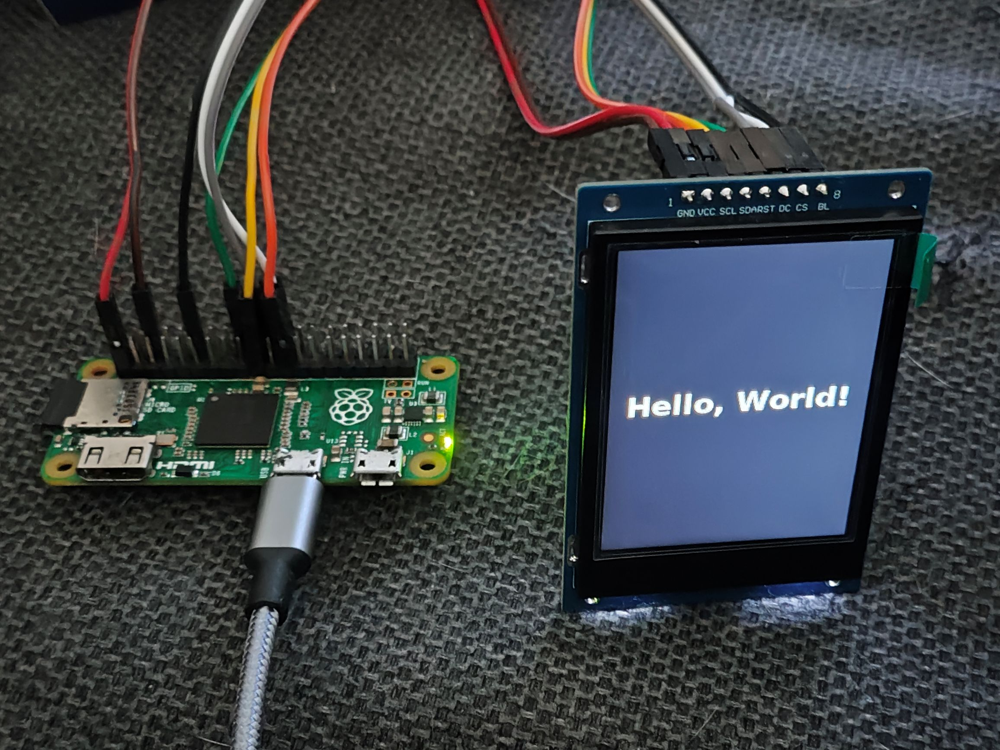
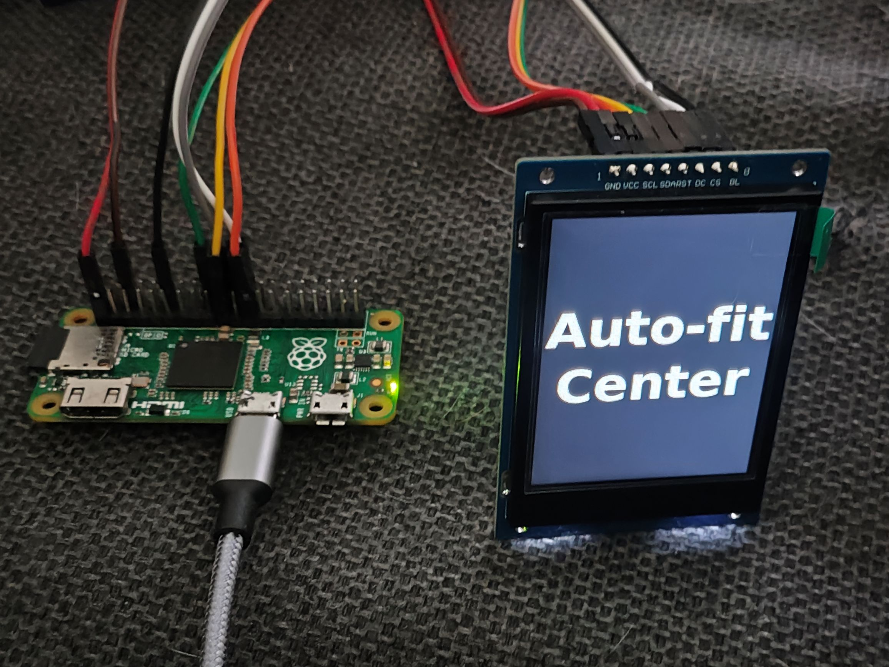

# TENSTAR_st7789v

An advanced Python library for controlling ST7789V-based displays on Raspberry Pi, developed for TENSTAR ROBOT display 2.4".

 

## Features

- ✅ Text rendering with font size, rotation, alignment, and auto-fit
- ✅ Multi-line and scrolling text (horizontal and vertical)
- ⚙️ Animated transitions: fade, slide, zoom, wipe, dissolve, and easing
- ✅ Optimized SPI communication and GPIO control

## Wiring

|  ST7789V Pin  |  Raspberry Pi Pin  | GPIO #  | Function              |
|---------------|--------------------|---------|-----------------------|
| VCC           | 3.3V (Pin 1)       | —       | Power                 |
| GND           | GND (Pin 6)        | —       | Ground                |
| SCL           | SPI0 SCLK (Pin 23) | GPIO 11 | SPI Clock             |
| SDA           | SPI0 MOSI (Pin 19) | GPIO 10 | SPI Data              |
| RES           | GPIO27 (Pin 13)    | GPIO 27 | Reset                 |
| DC            | GPIO25 (Pin 22)    | GPIO 25 | Data/Command select   |
| BLK           | GPIO18 (Pin 12)    | GPIO 18 | Backlight control     |
| CS (optional) | SPI0 CE0 (Pin 24)  | GPIO 8  | Chip Select (if used) |

## Installation

- Enable SPI: Run sudo raspi-config, go to Interface Options, and enable SPI.
- Clone the repository and install dependencies:

```bash
git clone https://github.com/duy-31/TENSTAR_st7789v/
cd TENSTAR_st7789v
python -m venv venv
source ./venv/bin/activate
pip install .

## Examples

python3 examples/example.py
→ Rotated and centered text display

python3 examples/example2.py
→ Dynamic font sizing and alignment

python3 examples/example_scroll.py
→ Horizontal and vertical scrolling text

## Author

Duy-31
📧 bui.duyhuan@free.fr

For questions, contributions, or bug reports, please visit the Issues page.
